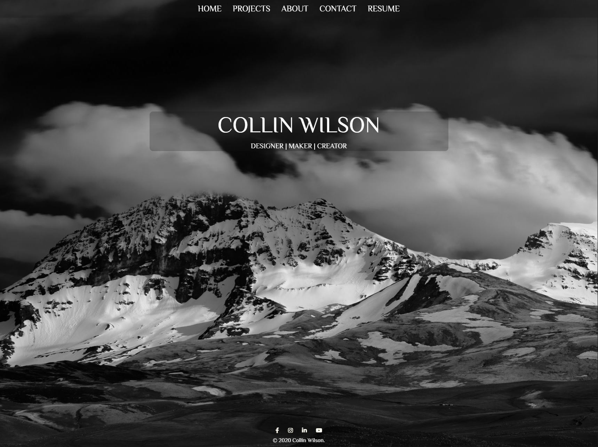

  # Collin-Wilson-React 
   [](https://github.com/wilsoncollin7?tab=followers) [](https://opensource.org/licenses/MIT) [](https://jessemillar.com/r/man-hours)

  This is my portfolio created using react! :rocket:

  Here is a live link to the app: [Portfolio](https://wilsoncollin7.github.io/react-portfolio/)

  <p align="center">
    
  </p>

  ## Table of Contents 

  - [Installation](#installation)
  - [License](#license)
  - [Contributing](#contributing)
  - [Tests](#tests)
  - [Questions](#questions)

  ## Installation

  Download the repo and run:

  ```
  npm install
  npm start
  ```

  ## License

  This aplication is made with the [MIT License](https://opensource.org/licenses/MIT)

  ## Contributing

  If you want to contribute please contact me!

  ## Tests

  If you find any bugs please contact me!

  ## Questions

  For any questions you might have, you can email me at wilsoncollin7@gmail.com. You can also check out my [GitHub Profile](https://github.com/wilsoncollin7).

  

